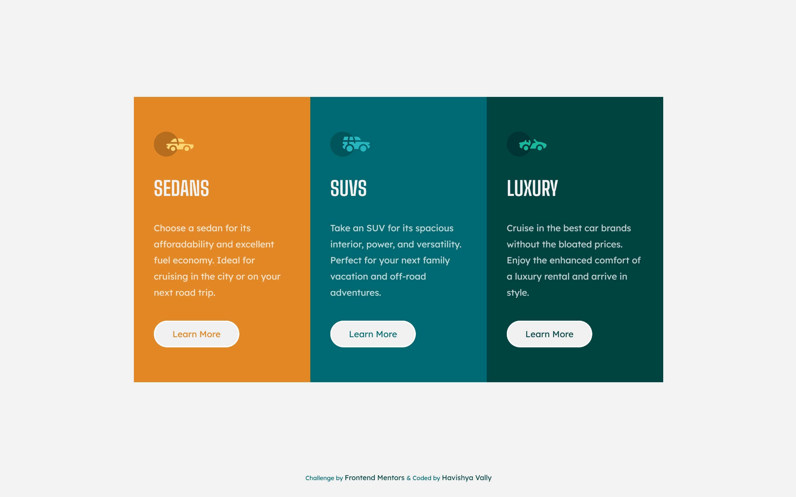

#  Frontend Mentor - 3-Column Preview Card Component

<div align="center">

  <div style="display: flex; justify-content: center; align-items: flex-end; gap: 20px; margin-bottom: 20px;">
    <!-- Replace with your specific image paths, usually located in /design folder -->
    

[//]: # (    )
  
</div>

  <h3>
    <a href="YOUR_LIVE_SITE_URL_HERE">Live Demo</a> 
    <span> | </span>
    <a href="YOUR_REPO_URL_HERE">Github</a>
  </h3>

  <p>A multi-column card component challenge from <a href="https://www.frontendmentor.io/challenges/3column-preview-card-component-pHl6ZycS">Frontend Mentor</a>.</p>

  <div style="display: flex; justify-content: center; gap: 10px; flex-wrap: wrap;">
    
    
    
    
    
  </div>
</div>

---

### 📝 Project Overview

This is my solution to the [3-Column Preview Card Component challenge on Frontend Mentor](https://www.frontendmentor.io/challenges/3column-preview-card-component-pHl6ZycS). The project required building a responsive vehicle category component that transitions from a single-column vertical stack on mobile to a three-column horizontal layout on desktop.

I focused on creating a robust layout engine using **CSS Grid** for the page structure and **Flexbox** for the internal card alignment.

### 🚀 Features

- **Responsive Grid:** Seamless transition from 1 column to 3 columns at the `605px` breakpoint.
- **Auto-Alignment:** The "Learn More" buttons are perfectly aligned at the bottom of the cards using Flexbox tricks, regardless of text length.
- **Smart Footer:** Utilized a `1fr 30px` grid row strategy to keep the footer anchored without using absolute positioning.
- **CSS Variables:** Extensive use of custom properties (`--gold-500`, `--cyan-800`) for easy theme management.

### 💡 Key Learnings

The most effective technique I implemented in this challenge was the **Button Alignment Trick**.

To ensure the "Learn More" buttons always stayed at the bottom of the cards—even if the description text varied in length—I applied `display: flex` to the card and used `margin-top: auto` on the button. This forces the button to consume all available vertical space above it.

```css
/* Flex container for the card */
.card-container div {
    display: flex;
    flex-direction: column;
    padding: 3.5em 2em;
}

/* The alignment trick */
button {
    margin-top: auto; /* Pushes button to the very bottom */
    width: fit-content;
    cursor: pointer;
}
```
### 📖 Technical Documentation

I have created a dedicated, styled documentation page that goes deeper into my layout strategy, color palette implementation, and specific code choices.

<div align="center">
  <a href="./documentation.html">
    
  </a>
</div>
---

### 👤 Author

- LinkedIn - [@HavishyaVally](https://www.linkedin.com/in/havishyavally/)
- Frontend Mentor - [@HavishyaVally](https://www.frontendmentor.io/profile/HavishyaVally)
- GitHub - [HavishyaVally](https://github.com/HavishyaVally)


---