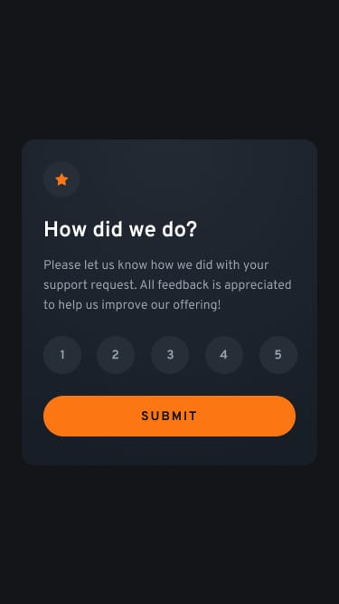

# </> Frontend Mentor - Interactive Rating Component

<div align="center">
  
  
</div>

<div align="center">
  <h3>
    <a href="YOUR_LIVE_SITE_URL_HERE">Live Demo</a> | 
    <a href="YOUR_GITHUB_REPO_URL_HERE">Github</a>
  </h3>
  <p>An interactive rating component challenge from <a href="https://www.frontendmentor.io/challenges/interactive-rating-component-koxpeBUmI">Frontend Mentor</a>.</p>
</div>

<div align="center">
  
  
  
  
  
</div>

---

## 📝 Project Overview

This is my solution to the [Interactive rating component challenge on Frontend Mentor](https://www.frontendmentor.io/challenges/interactive-rating-component-koxpeBUmI). This challenge was a great exercise in managing UI state with Vanilla JavaScript, capturing user inputs, and implementing modern CSS layout techniques for a pixel-perfect design.

## 🚀 Features

* **State Management:** Seamlessly transitions from the rating card to the "Thank You" state upon submission without page reloads.
* **Interactive Elements:** Custom hover, focus, and active states for the rating selection, plus logic to keep the submit button disabled until a choice is made.
* **Optimal Layout:** Responsive design centered perfectly across all screen sizes using CSS Grid.
* **Modern CSS:** Built a scalable design system utilizing CSS Custom Properties (`:root` variables) for all colors and typography.

## 💡 Key Learnings
## 💡 Key Learnings

### 1. State-Driven Class Toggling
Instead of manipulating `element.style` directly in JavaScript (which splits the design logic between two files), I learned to manage states purely by toggling classes. This **Separation of Concerns** leaves the visual presentation entirely to CSS.

```javascript
// Clean state management using class toggling instead of inline styles
submit_btn.addEventListener("click", () => {
    rating_container_el.classList.add("hide")
    success_msg_el.classList.remove("hide")
})
```

### 2. Accessibility (A11y) & Semantic HTML
Through this challenge, I realized that using `<li>` for interactive elements like ratings creates a barrier for keyboard and screen-reader users. Moving forward, I am implementing **Form-First logic**:
* Using `<input type="radio">` for single-choice selections.
* Wrapping inputs in a `<fieldset>` with a `<legend>` for context.
* This ensures the component is fully navigable via keyboard and understandable by assistive technology.

### 3. Scalable CSS Units (The rem/em Strategy)
I've refined my strategy for CSS units to ensure the layout is robust and responsive:
* **`rem` for Typography & Layout:** Ensures the whole component scales if the user changes their browser's default font size.
* **`em` for Local Spacing:** Used for padding inside buttons so the spacing remains proportional to the text size.
* **`px` for "Static" Borders:** Used for 1px lines or subtle shadows where a fixed physical size is preferred.
* **`dvh` for Layout:** Used `min-height: 100dvh` for the body wrapper to prevent the "mobile address bar" bug common with `vh`.
* **`%` for Widths:** Used `width: 100%` instead of `vw` to avoid horizontal scrollbar issues caused by browser scrollbars.


## 👤 Author

* LinkedIn - [@HavishyaVally](YOUR_LINKEDIN_URL)
* Frontend Mentor - [@HavishyaVally](https://www.frontendmentor.io/profile/HavishyaVally)
* GitHub - [HavishyaVally](https://github.com/HavishyaVally)