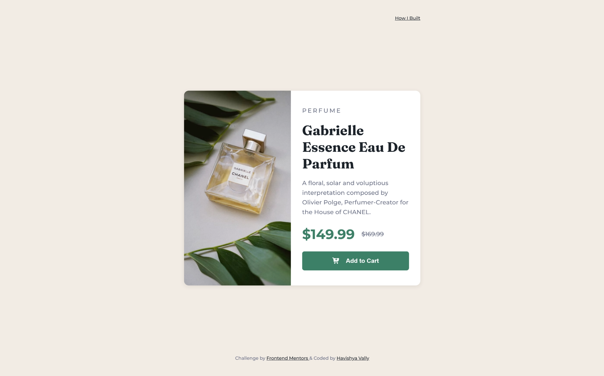
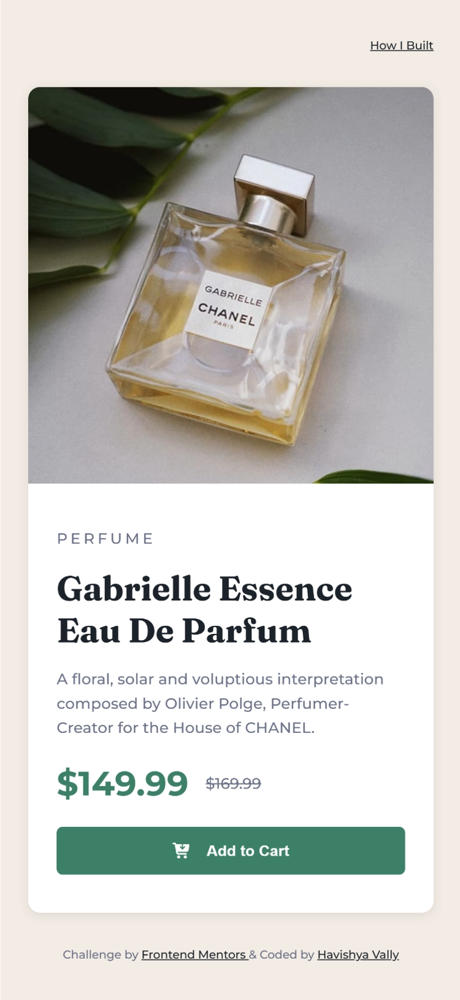

#  Frontend Mentor - Product Preview Card Component

<div align="center">

  <div style="display: flex; justify-content: center; align-items: flex-end; gap: 20px; margin-bottom: 20px;">
    
    
  </div>

  <h3>
    <a href="https://productprvcard.netlify.app/">Live Demo</a> 
    <span> | </span>
    <a href="https://github.com/HavishyaVally/Frontend-Mentors/tree/main/5_Newbie/product-preview-card-component-main">GitHub Repo</a>
  </h3>

  <p>A beautiful product preview card component challenge from <a href="https://www.frontendmentor.io">Frontend Mentor</a>.</p>

  <div style="display: flex; justify-content: center; gap: 10px; flex-wrap: wrap;">
    
    
    
    
    
  </div>
</div>

---

### 📝 Project Overview

This is my solution to the [Product preview card component challenge on Frontend Mentor](https://www.frontendmentor.io/challenges/product-preview-card-component-GO7UmttRfa). This challenge was a great exercise in building a responsive component with a focus on art direction and modern CSS techniques.

### 🚀 Features

- **Optimal Layout:** Responsive design for various screen sizes.
- **Interactive Elements:** Hover and focus states for buttons.
- **Art Direction:** Used the `<picture>` element for optimized image delivery.
- **Modern CSS:** Implemented CSS Nesting for cleaner media queries.

### 💡 Key Learnings

One of the highlights was implementing **CSS Nesting**. It allowed me to keep responsive logic right inside the component's block, making the code much easier to read and maintain.

I also focused on performance by using the `<picture>` element to intelligently select the correct asset based on the viewport width.

```html
<picture class="card-image">
  <source media="(min-width: 435px)" srcset="images/image-product-desktop.jpg">
  
</picture>
```

---

### 📖 Technical Documentation

I have created a dedicated, styled documentation page that goes deeper into my technical approach, design philosophy, and specific code implementations.

<div align="center">
  <a href="https://productprvcard.netlify.app/documentation">
    
  </a>
</div>

---

### 👤 Author

- Frontend Mentor - [@HavishyaVally](https://www.frontendmentor.io/profile/HavishyaVally)
- GitHub - [HavishyaVally](https://github.com/HavishyaVally)

---

<div align="center">
  <sub>Built with ❤️ by Havishya Vally</sub>
</div>
