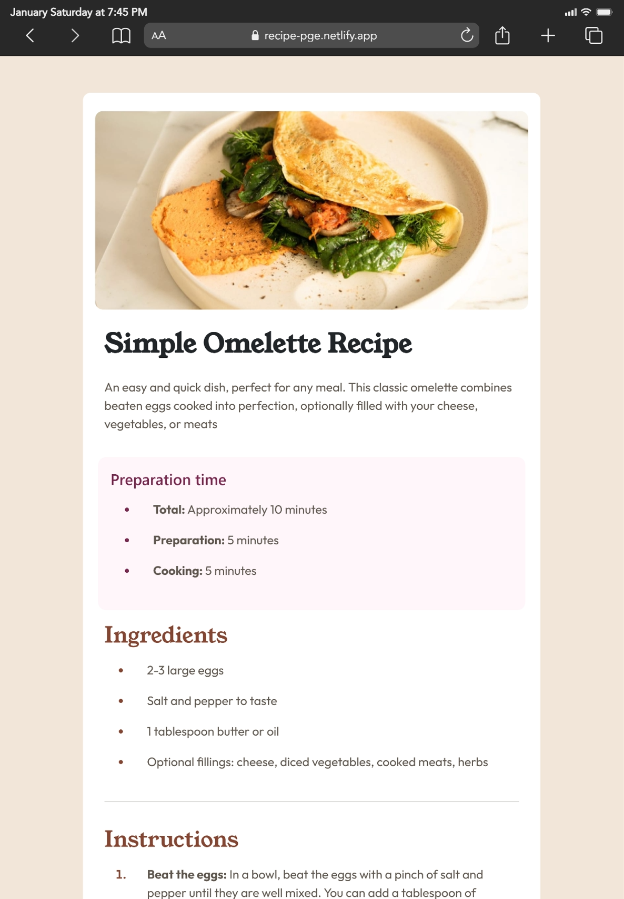
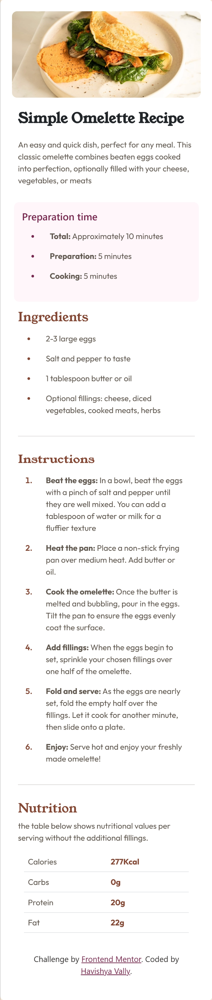

# 🍳 Frontend Mentor - Recipe Page

<div align="center">
  <div style="display: flex; justify-content: center; align-items: flex-end; gap: 20px; margin-bottom: 20px;">
    
    
  </div>
  <!-- Replace with your actual image paths. I've assumed standard naming convention -->
</div>

<div align="center">
  <h3>
    <a href="https://recipe-page-ashen-chi.vercel.app/">Live Demo</a>
    <span> | </span>
    <a href="https://github.com/HavishyaVally/Frontend-Mentors/tree/main/5_Newbie/recipe-page-main">Github</a>
  </h3>
</div>

<div align="center">
   A responsive recipe page solution for the Frontend Mentor challenge.
</div>

<div align="center">
  <br>
  
  
  
</div>

<br>

## 📄 Project Overview

This is my solution to the [Recipe page challenge on Frontend Mentor](https://www.frontendmentor.io/challenges/recipe-page-KiTsR8QQKm). This challenge was a great exercise in combining a CSS framework with custom styling to achieve a pixel-perfect design.

I utilized **Bootstrap 5** to handle the core responsiveness and layout structure, while writing custom CSS to manage the specific typography, colors, and list styling required by the design brief.

## 🚀 Features

*   **Responsive Layout:** Fully responsive design that adapts from mobile to desktop using Bootstrap's grid system (`col-12`, `container`).
*   **Custom Typography:** Integration of Google Fonts (**Young Serif** for headings and **Outfit** for body text).
*   **Styled Lists:** Custom styling for `<ul>` and `<ol>` markers to match the specific brand colors.
*   **Nutrition Table:** A clean, semantic table layout for nutritional information.
*   **Card-based UI:** The main content is contained within a centered, shadow-boxed card on desktop views.

## 💡 Key Learnings

One of the main highlights of this project was customizing the native HTML list markers. Instead of wrapping every list item in a `<span>` to color the numbers/bullets differently from the text, I used the CSS `::marker` pseudo-element.

This allowed me to change the color and weight of the numbers/bullets independently of the content text.

```css
/* Customizing list markers */
.prep li::marker {
    color: hsl(332, 51%, 32%); /* Dark Raspberry */
}

li::marker {
    font-weight: 600;
    color: hsl(14, 45%, 36%); /* Nutmeg */
}
```


---

### 👤 Author

- LinkedIn - [@HavishyaVally](https://www.linkedin.com/in/havishyavally/)
- Frontend Mentor - [@HavishyaVally](https://www.frontendmentor.io/profile/HavishyaVally)
- GitHub - [HavishyaVally](https://github.com/HavishyaVally)


---

