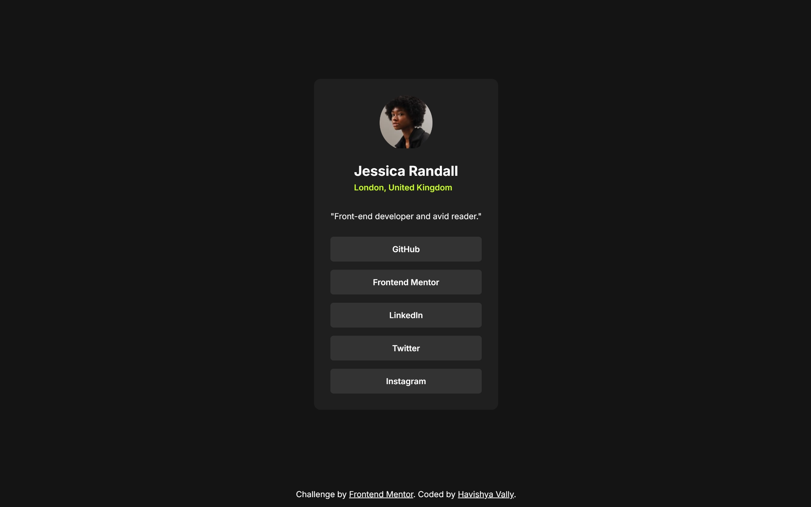
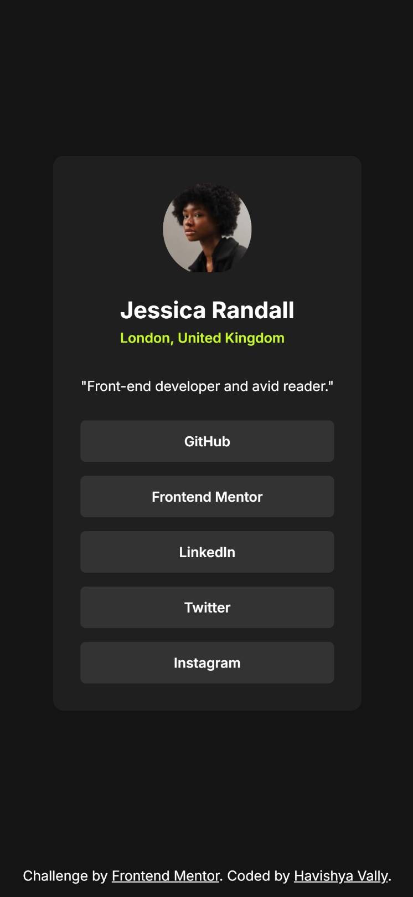

# 🔗 Frontend Mentor - Social Links Profile

<div align="center">

  <div style="display: flex; justify-content: center; align-items: flex-end; gap: 20px; margin-bottom: 20px;">
    
    
  </div>

### [Live Demo](https://social-links-profile-livid-five.vercel.app/) | [Portfolio](YOUR_REPO_URL_HERE)

  <p>A social link sharing profile challenge from <a href="https://www.frontendmentor.io/challenges/social-links-profile-UG32l9m6dQ">Frontend Mentor</a>.</p>

  <!-- Badges -->
  
  
  
  

</div>

<br>

---

### 📄 Project Overview

This is my solution to the [Social Links Profile challenge on Frontend Mentor](https://www.frontendmentor.io/challenges/social-links-profile-UG32l9m6dQ). The goal was to build a profile card that matches the provided design, featuring a responsive layout and interactive hover states for social media links.

I focused on writing clean, semantic HTML and using modern CSS layout techniques to ensure the component is perfectly centered on any screen size.

---
### 🚀 Features

- **Optimal Layout:** Used CSS Grid to center the card vertically and horizontally within the viewport.
- **Interactive Elements:** Implemented smooth hover states that invert colors to Neon Green (`hsl(75, 94%, 57%)`) for clear user feedback.
- **Flexbox Structure:** utilized Flexbox (`flex-direction: column`) to organize the internal content and button list efficiently.
- **Responsive Design:** The card adapts fluidly to mobile and desktop viewports without breaking layout.
---
### 💡 Key Learnings

In this project, I refined my understanding of **CSS Grid** for page layouts. Specifically, I learned how to use `place-items: center` combined with `grid-template-rows` to center the main content while managing the footer positioning effectively.

I also practiced managing button states and inheritance using simple CSS selectors.

```css
/* Centering the component while pushing footer to bottom */
body {
  display: grid;
  place-items: center;
  place-content: center;
  grid-template-rows: 1fr 30px; /* Allocated space for content vs footer */
  min-height: 100vh;
}

/* Hover effect logic */
.social-links a:hover {
  background: hsl(75, 94%, 57%); /* Neon Green */
  color: hsl(0, 0%, 8%);         /* Dark Background Color */
  font-weight: 700;
}
```
---

### 👤 Author

- LinkedIn - [@HavishyaVally](https://www.linkedin.com/in/havishyavally/)
- Frontend Mentor - [@HavishyaVally](https://www.frontendmentor.io/profile/HavishyaVally)
- GitHub - [HavishyaVally](https://github.com/HavishyaVally)


---

