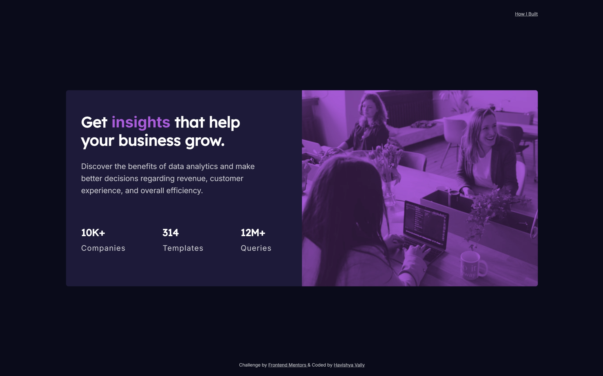
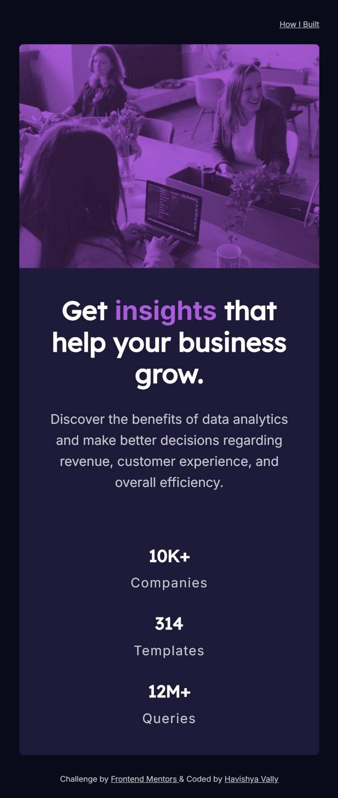

#  Frontend Mentor - Stats Preview Card Component

<div align="center">

  <div style="display: flex; justify-content: center; align-items: flex-end; gap: 20px; margin-bottom: 20px;">
    
    
  </div>

  <h3>
    <a href="https://havishyavally.github.io/stats-preview-card-component/">Live Demo</a> 
    <span> | </span>
    <a href="https://github.com/HavishyaVally/Frontend-Mentors/tree/main/5_Newbie/stats-preview-card-component-main">Github</a>
  </h3>

  <p>A stats preview card component challenge from <a href="https://www.frontendmentor.io">Frontend Mentor</a>.</p>

  <div style="display: flex; justify-content: center; gap: 10px; flex-wrap: wrap;">
    
    
    
    
    
  </div>
</div>

---

### 📝 Project Overview

This is my solution to the [Stats preview card component challenge on Frontend Mentor](https://www.frontendmentor.io/challenges/stats-preview-card-component-8JqbgoU62). The project involves building a card that displays business statistics with a responsive layout and a distinctive purple image overlay, testing my ability to handle complex CSS blending and art direction.

### 🚀 Features

- **Responsive Design:** Seamless transition from mobile-first vertical stack to desktop horizontal layout.
- **Image Tinting:** Implementation of the purple overlay using `mix-blend-mode` for a professional aesthetic.
- **Optimization:** Using the `<picture>` tag to serve optimized header images for different viewports.

### 💡 Key Learnings

One of the most challenging and rewarding parts of this project was mastering the **purple image overlay**. Instead of using a simple semi-transparent div, I used `mix-blend-mode: multiply` on the image within a container that has the brand's primary purple background.

```css
/* Achieving the purple tint effect */
.card-image {
    background-color: var(--accent); /* HSL(277, 64%, 61%) */
}

img {
    mix-blend-mode: multiply;
    opacity: 0.75;
}
```

I also refined my **Flexbox** skills by using `flex-wrap: wrap` to handle the responsive layout of the card and the stats container without needing excessive media queries.

---

### 📖 Technical Documentation

I have created a comprehensive technical breakdown that goes deeper into my CSS architecture, grid/flex strategies, and specific implementation details.

<div align="center">
  <a href="document.html">
    
  </a>
</div>

---

### 👤 Author

- LinkedIn - [@HavishyaVally](https://www.linkedin.com/in/havishyavally/)
- Frontend Mentor - [@HavishyaVally](https://www.frontendmentor.io/profile/HavishyaVally)
- GitHub - [HavishyaVally](https://github.com/HavishyaVally)


---
